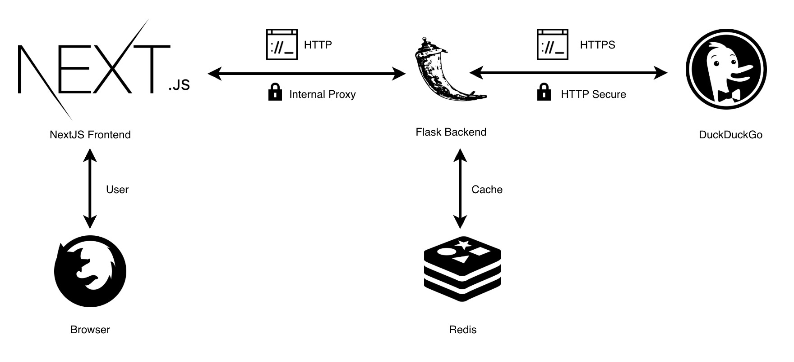
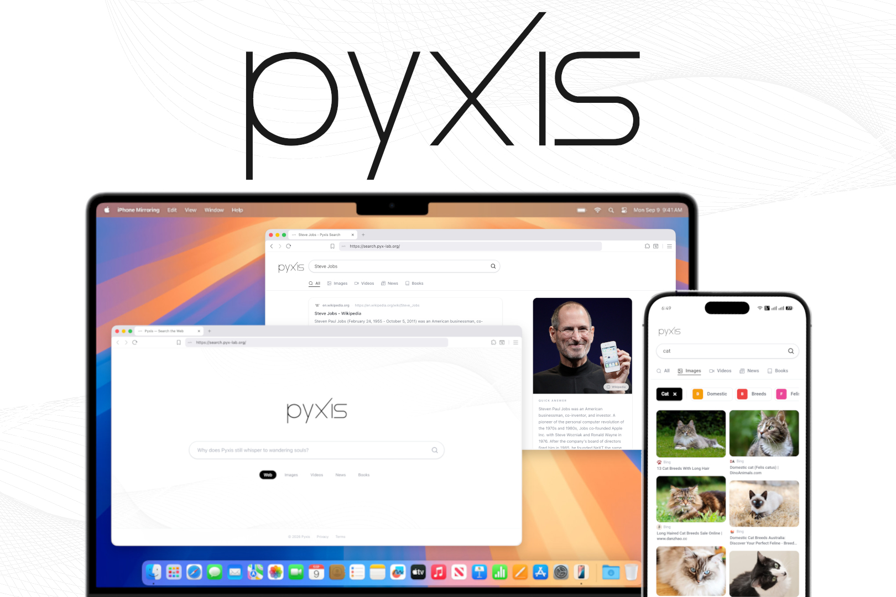

# Pyxis Search Engine

[](https://www.gnu.org/licenses/gpl-3.0)

**Pyxis** is an open-source, privacy-respecting search engine developed by **PyxLab**. It provides fast, relevant results across text, images, videos, news, and books by aggregating data from multiple search engines with automatic backend selection, enriched with instant answers and autocomplete suggestions. The project consists of a **Next.js frontend** (App Router) and a **Flask backend** with Redis caching, designed for easy self-hosting on Linux servers.

---

## Features

- **Multi-type search** – Text, images, videos, news, and books via `ddgs` (DDGS | Dux Distributed Global Search), a metasearch library that aggregates results from diverse web search services. Backends vary by type: text uses Bing, Brave, DuckDuckGo, Google, Grokipedia, Mojeek, Yandex, Yahoo, or Wikipedia; images use Bing or DuckDuckGo; news uses Bing, DuckDuckGo, or Yahoo; books use Anna's Archive.
- **Instant answers** – Concise factual answers with an optional related image (Wikipedia/Wikimedia Commons).
- **Autocomplete** – Real-time query suggestions from a local CSV-based engine using English word frequency data.
- **Content filtering** – Blocked domains and keywords loaded from CSV files; safe-image extension enforcement.
- **Privacy first** – No user tracking; all requests are proxied server-side with safe search enabled by default.
- **Redis caching** – Per-type TTLs reduce latency and external API calls.
- **Modern frontend** – Next.js (App Router), TypeScript, Tailwind CSS v4, Framer Motion, and SWR.
- **PM2 ready** – Ecosystem configs for both backend and frontend ensure high availability in production.

---

## Architecture Overview



- **Frontend** – Next.js App Router application. API calls are proxied to the backend via Next.js rewrites (`/api/*` → `http://localhost:5000`).
- **Backend** – Flask REST API. Fetches from multiple search engines via `ddgs`, applies content filters, and caches responses in Redis.
- **Redis** – Optional in development, recommended in production.

---

## Product Overview



---

## Getting Started

### Prerequisites

- Linux (Debian 11/12 or Ubuntu 20.04+ recommended) or macOS for development
- **Node.js** 20 LTS or higher
- **Python** 3.10 or higher
- **Redis** (optional for development, recommended for production)
- **Git**

### Clone

```bash
git clone https://github.com/muyeed15/pyxis.git
cd pyxis
```

---

## Backend Setup

```bash
cd backend/python
```

**Create a virtual environment:**

```bash
# Conda
conda create -n pyxis python=3.10 && conda activate pyxis

# or venv
python3 -m venv venv && source venv/bin/activate
```

**Install dependencies:**

```bash
pip install -r requirements.txt
```

**Keep dependencies up to date** – `ddgs` must stay current or searches will break:

```bash
pip install pip-review
pip-review          # review available updates
pip-review --auto   # apply all updates
```

**Install and start Redis:**

```bash
sudo apt update && sudo apt install redis-server
sudo systemctl enable --now redis-server
redis-cli ping   # should return PONG
```

**Configure environment:**

```bash
cp env.example .env
# Edit .env -- at minimum check REDIS_URL
```

**Prepare datasets** – place CSV files in `autocomplete/dataset/` and `filters/` (see [backend README](backend/python/README.md)).

**Run:**

```bash
# Development
python app.py

# Production (PM2 recommended)
pm2 start ecosystem.config.js
```

---

## Frontend Setup

```bash
cd frontend/client
npm install
cp env.example .env
```

Edit `.env` if your backend is not at `http://localhost:5000`.

```bash
# Development
npm run dev

# Production
npm run build && npm start
```

Open [http://localhost:3000](http://localhost:3000).

---

## Running in Production

### Backend (Flask) with PM2

```bash
cd backend/python
sudo npm install -g pm2
pm2 start ecosystem.config.js
pm2 save && pm2 startup
```

### Frontend (Next.js) with PM2

```bash
cd frontend/client
npm run build
```

Create `ecosystem.config.js` (example):

```javascript
module.exports = {
  apps: [
    {
      name: "pyxis-frontend",
      cwd: "/path/to/frontend/client",
      script: "node_modules/.bin/next",
      args: "start",
      env: { NODE_ENV: "production", PORT: 3000 },
    },
  ],
};
```

```bash
pm2 start ecosystem.config.js
pm2 save && pm2 startup
```

Verify both are running: `pm2 status`

---

## API Documentation

### `GET /`

Returns basic API info.

### `GET /help`

Returns endpoint documentation and module status.

### `GET /search`

| Parameter | Description                                                          | Example       |
| --------- | -------------------------------------------------------------------- | ------------- |
| `q`       | Search query                                                         | `q=python`    |
| `type`    | `text` \| `images` \| `videos` \| `news` \| `books` (default `text`) | `type=images` |
| `page`    | Page number, 1-based (default `1`)                                   | `page=2`      |

```
GET /search?q=artificial+intelligence&type=text&page=1
```

### `GET /autocomplete`

| Parameter | Description   | Example    |
| --------- | ------------- | ---------- |
| `q`       | Partial query | `q=how+to` |

```
GET /autocomplete?q=how+to
```

### `GET /instant`

| Parameter | Description | Example       |
| --------- | ----------- | ------------- |
| `q`       | Query       | `q=elon+musk` |

```
GET /instant?q=elon+musk
```

---

## Troubleshooting

- **Redis connection errors** – check `redis-cli ping` and `REDIS_URL` in `.env`.
- **Autocomplete unavailable** – verify CSV files exist in `autocomplete/dataset/`.
- **PM2 not starting** – run `pm2 logs pyxis-flask-backend` for details.
- **Backend connection refused (frontend)** – ensure the backend is running and `NEXT_PUBLIC_URL_BACKEND_API` is set correctly.

---

## Acknowledgments

Pyxis relies on these open-source projects:

- **[ddgs](https://github.com/deedy5/ddgs)** – DDGS | Dux Distributed Global Search. A metasearch library that aggregates results from diverse web search services. MIT License. Copyright (c) 2024 deedy5.
- **English Word Frequency Dataset** – derived from the [Google Web Trillion Word Corpus](https://catalog.ldc.upenn.edu/LDC2006T13) (Thorsten Brants and Alex Franz), processed by Peter Norvig ([norvig.com/ngrams](https://norvig.com/ngrams/)). Used for autocomplete ranking.

---

## License

Licensed under the **GNU General Public License v3.0**. See [LICENSE](LICENSE) for details.

---

**Built with ❤️ by PyxLab**
